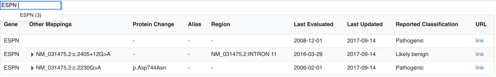

## Install

``` bash
# Install dependencies for server
npm install

# Install dependencies for client
npm run client-install

# Run the client & server with concurrently
npm run dev

# Run server tests
npm run test

# Server runs on http://localhost:5000 and client on http://localhost:3000
```
 
## Demo



There are two endpoints:
* `/api/search:name` This return all the rows of the TSV file with the gene name passed
* `/autosuggest` This returns all the possible search value in a single array with how many results each name has 

## API
There are two endpoints:
* `/api/search:name` This return all the rows of the TSV file with the gene name passed
* `/autosuggest` This returns all the possible search value in a single array with how many results each name has 
            
## Built with
React 
Semantic UI React
React Autocomplete

## Proposed Enhancements 

* Make the auto-suggest api return only a subset of matching keyworks for scaling to large datasets
* Auto-suggest uses more advanced regex that doesn't require continous or adjacent letters to match
* Make table paginate 
* Make server response paginate if data size warrants
* Make table sortable
* Unit testing for UI components